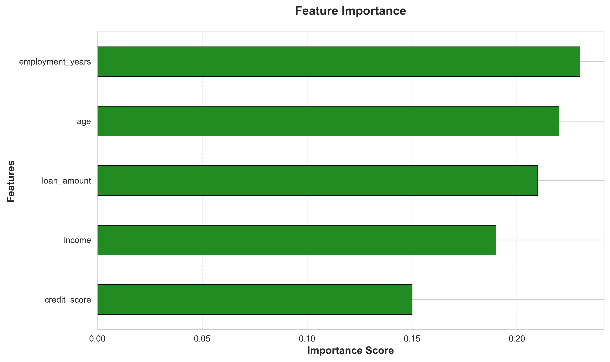
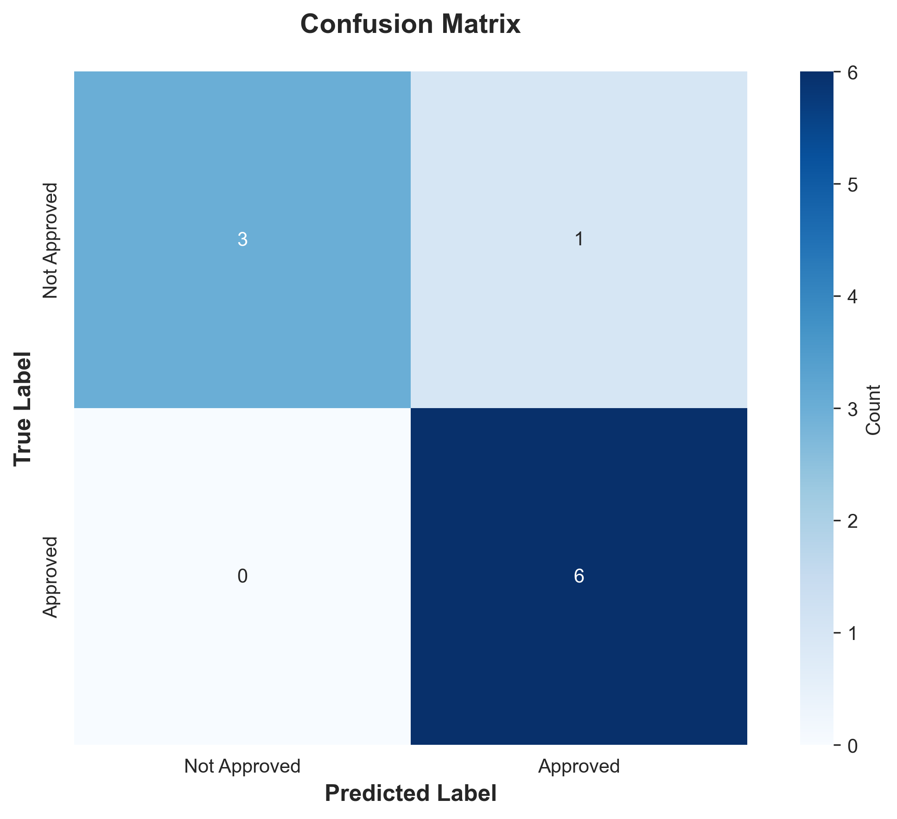

# 🌲 Random Forest Template: Ensemble Learning

## 🚀 Project Overview
**Developed a robust Python template for implementing Random Forest, a powerful ensemble learning method designed to reduce overfitting and increase predictive accuracy.**

This project aggregates hundreds of decision trees ("The Forest") to create a stable and high-performance classifier. The template automates the critical steps of ensemble modeling, including hyperparameter setup (n_estimators) and feature ranking, making it a reliable "workhorse" solution for complex tabular data.

---

## 📊 Key Results & Visualizations

### 1. Feature Importance Ranking
One of the most powerful outputs of a Random Forest is its ability to score feature relevance. This chart ranks the variables by their contribution to the model's predictive power, offering actionable data insights.

### 2. Confusion Matrix Heatmap
Evaluating the ensemble's performance on unseen test data. This heatmap visualizes the True Positives and False Negatives, confirming the model's robustness.

---

## 🛠 Tech Stack
* **Language:** Python 3.9+
* **Modeling:** Scikit-learn (RandomForestClassifier)
* **Data Manipulation:** Pandas, NumPy
* **Visualization:** Seaborn, Matplotlib

---

## 🔒 Source Code Access
*This repository serves as a showcase of the project's methodology and results.*

Due to the proprietary nature of the implementation (or data sensitivity), the full source code is stored in a private repository. However, detailed code walkthroughs and architecture discussions are available upon request for interviewers.
